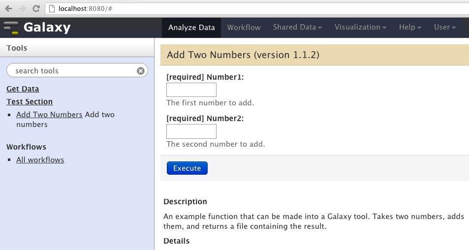
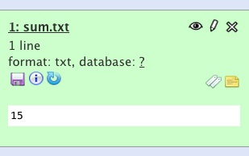

<!--
%\VignetteEngine{knitr::knitr}
%\VignetteIndexEntry{Introduction to RGalaxy}
-->
````{r setup, echo=FALSE}
options(width = 75)
options(useFancyQuotes=FALSE)
```

```{r hook-printfun, echo=FALSE}
library(knitr)
library(formatR)
knit_hooks$set(printfun = function(before, options, envir) {
  if (before) return()
  txt = capture.output(dump(options$printfun, '', envir = envir))
  ## reformat if tidy=TRUE
  if (options$tidy)
  	txt = tidy.source(text=txt, output=FALSE,
  		width.cutoff=30L, keep.comment=TRUE,
  		keep.blank.line=FALSE)$text.tidy
  paste(c('\n```r\n', txt, '\n```\n'), collapse="\n")
})
```
```{r hook-printmanpage, echo=FALSE}
knit_hooks$set(printmanpage = function(before, options, envir) {
  if (before) return()
    manpage <- file.path("..", "man",
      sprintf("%s.Rd", options$printmanpage))
  lines <- readLines(manpage)
  ret <- "\n"
  for (line in lines)
  {
      ret <- paste(ret, "\t", line, "\n", sep="")
  }
  ret
})
```


# RGalaxy

### Dan Tenenbaum

[Galaxy](http://galaxyproject.org/)
is an open, web-based platform for data-intensive biomedical research.
It provides an easy-to-use web interface and can expose bioinformatics
workflows written in any programming language.

Normally, in order to expose new functionality (a tool in Galaxy parlance)
in a Galaxy instance, you have to manually create an XML file with
information about the function, and modify an additional XML file.

The `RGalaxy` package automates this process, pulling most of the necessary
information from the function itself and its manual page (you provide the
remaining information as arguments to the `galaxy` function).

## A Simple Example

Let's say you want to create a Galaxy tool that adds two numbers.

First, load `RGalaxy`:

```{r library_RGalaxy_fake, eval=FALSE}
library(RGalaxy)
```
```{r library_RGalaxy_real, echo=FALSE, results="hide"}
suppressPackageStartupMessages(library(RGalaxy))
```
Then write a function like this:
```{r addTwoNumbers, printfun='addTwoNumbers', echo=FALSE, tidy=FALSE}
#source code goes here
```

There are a few things to notice about this function:

* The data type of each parameter is specified. And instead of 
  just specifying `R`'s `numeric` type, we are using a special
  class called `GalaxyNumericParam`. This is because Galaxy
  (unlike `R`) needs to know the type of each parameter,
  as well as other information
* The function's name is descriptive.
* The return value of the function is not important. 
* All the function's inputs and outputs are specified as
  arguments in its signature. This is required as Galaxy
  communicates with tools by sending them files and reading
  files they generate.
* By default, parameters are marked as not required by Galaxy.
  Adding `required=TRUE` tells Galaxy not to allow empty values.
* This function can be run from within R, passing it ordinary
`numeric` values:

```{r run_addTwoNumbers}
t <- tempfile()
addTwoNumbers(2, 2, t)
readLines(t, warn=FALSE)
```

## Documenting the Example

We're almost ready to tell Galaxy about our function, but first we
need to document it with a manual page. `RGalaxy` will use information
in this page to create the Galaxy tool, and the man page will also
be useful to anyone who wants to run your function in `R`.

The man page might look like this:
```{r addTwoNumbers_man, printmanpage='addTwoNumbers', echo=FALSE, tidy=FALSE}
#source code goes here
```
Some things to note about this man page:

* The `name`, `alias`, `description`, `title`, `usage`, and
  `arguments` sections are required. The `details` section
  is not required but its use is encouraged (`RGalaxy` will
  notify you if this section is missing).
* While it's good to have an `examples` section, this section
  is only useful to people running your function via `R`.
  This section is not used by `RGalaxy`.

## Installing Galaxy

Before we can tell Galaxy about our function, we have to install
Galaxy.

The [Galaxy Installation page](http://wiki.g2.bx.psu.edu/Admin/Get%20Galaxy)
gives full instructions, but in a nutshell, you can install
Galaxy as follows (you may need to install
[Mercurial](http://mercurial.selenic.com/), which provides the `hg` command):

    hg clone https://bitbucket.org/galaxy/galaxy-dist/

The directory where you just installed Galaxy (a full path ending in
`galaxy-dist`) is your "Galaxy Home" directory, represented by
`galaxyHome` in the following code snippet.

```{r galaxyHomeSetup, echo=FALSE, results="hide"}
if (!exists("galaxyHome"))
  galaxyHome <- getwd()
toolDir <- "RGalaxy_test_tool"
funcName <- "functionToGalaxify"

file.copy(system.file("galaxy", "tool_conf.xml", package="RGalaxy"),
    file.path(galaxyHome, "tool_conf.xml"), overwrite=FALSE)
 if(!file.exists("test-data")) dir.create("test-data", )
```

## Telling Galaxy about the function

Now we point Galaxy to the function we just wrote:

```{r run_galaxy, tidy=FALSE}
galaxy("addTwoNumbers",
    galaxyConfig=
      GalaxyConfig(galaxyHome, "mytool", "Test Section",
        "testSectionId")
    )
```

Notice the warning about functional tests. We'll cover that
later in the vignette. 

The `galaxy` function notifies you that the `details` section
of the man page is empty. It also returns the path to the
XML tool wrapper it created.

## Running the example function in Galaxy

To start Galaxy, open a command window and change to your
Galaxy home directory (defined earlier). Then issue this command:

  ./run.sh --reload

If Galaxy is already running, you should stop it
(with control-C) and restart it with the command above.
Galaxy should always be restarted after running the 
`galaxy` function.

You can now access Galaxy at
[http://localhost:3000](http://localhost:3000).

If you click on "Test Section" and then "Add Two Numbers", you
should see something like Figure 1.



Things to notice about this:

* `RGalaxy` has generated a tool in which each parameter
  has some explanatory text that comes from our man page.
* The tool name ("Add Two Numbers") comes from the function
  name (this can   be overridden by passing `name` to `galaxy()`).
* If you try and enter a non-number, Galaxy will complain.
  This is because we specified `GalaxyNumericParam` in our
  function.
* If you try and leave either of the numbers blank, Galaxy
  will complain. This is because we specified `required=TRUE`.

If we enter 10 and 5, then click "Execute", Galaxy will run and
when finished will show 'sum.txt' in the History Pane at the right.
Clicking on it should show something like Figure 2. You can download
the result or send it to another Galaxy tool.



## Functional Testing

We just ran Galaxy and made sure our tool worked.
It would be nice to automate this procedure so we
can know that for inputs `x` and `y`, our tool
will always produce output `d`. 

With a couple of small additions, we can accomplish this.
Our function will have a self-contained test.

Also, when submitting tools to the public Galaxy instance,
functional tests like this are required.

Here is our `addTwoNumbers` function again, this time with
a functional test:

```{r addTwoNumbersWithTest, printfun='addTwoNumbersWithTest', echo=FALSE, tidy=FALSE}
#source code goes here
```


The only visible difference is that we've added a `testValues`
argument to each input parameter. 
Another, subtler difference is that we have added
a file in our package called `inst/functionalTests/addTwoNumbersWithTest/sum`,
which contains the expected output of the function.
By using this convention, we ensure RGalaxy can find the file. 

Does the function pass its functional test?

```{r runFunctionalTest}
runFunctionalTest(addTwoNumbersWithTest)
```

Note that this just runs the function in `R`, it does not test it
inside a running Galaxy. But because the functional test infrastructure is
present in the XML file generated by `RGalaxy`, you can do that from your
Galaxy home directory as follows:

    ./run_functional_tests.sh -id addTwoNumbersWithTest

The output of the test will be written to `run_functional_tests.html`.

Note that `R` doesn't always produce the same output each time,
even though the files may look identical. The `pdf` function 
in particular may produce different files. You can use the `png`
function as a workaround.

### Should my function be in a package?

We've glossed over it so far, but the `addTwoNumbers()` function
and its man page live a package (the `RGalaxy` package in this case). 
It is possible to expose in Galaxy a function that does not
live in a package, but you have to provide a lot of extra information.
We recommend that the functions you expose live in a package
(and be exported in your NAMESPACE file).


## Best practices

* If your function depends on other packages, load those packages
  with `library()` within your function.
* Your code should handle improper input and other error conditions
  with the function `gstop()`. Error messages will be seen
  by the Galaxy user. Also use `gwarning()` and `gmessage()` for
  warnings and informational messages.


## Using Rserve for better performance

Galaxy runs tools by invoking scripts in various languages
at the command line. These scripts are generally self-contained.
Sometimes it can take a long time for the script to load its 
dependencies. Sometimes this takes longer than the actual
work that the script is supposed to do. We can stop
waiting for the script to load its dependencies if 
the script does its work on a remote instance of `R` where
the dependencies have already been loaded. We accomplish this
using the
[Rserve](http://cran.r-project.org/web/packages/Rserve/index.html)
package.

To use `Rserve`, create an `Rserv.conf` file that contains statements
like this:

    eval library(LongLoadingPackage1)
    eval library(LongLoadingPackage2)

Replace the package names with the packages your function
uses that take a long time to load.

Start Rserve as follows:

    R CMD Rserve --vanilla --RS-conf Rserv.conf

Re-run Galaxy on your function, specifying that Rserv should be used:

```{r withRserve, tidy=FALSE, eval=FALSE}
galaxy("addTwoNumbersWithTest",
    galaxyConfig=
      GalaxyConfig(galaxyHome, "mytool", "Test Section",
        "testSectionId"),
    RserveConnection=RserveConnection()
    )
```

Install the RSclient package:

```{r install_RSclient, eval=FALSE}
source("http://bioconductor.org/biocLite.R")
biocLite("RSclient", siteRepos="http://www.rforge.net")
```


Restart Galaxy if it is already running. Your function should 
be much faster.

You can run Rserve on a different machine (and on a different port)
by passing this information to the `RserveConnection()` function:

```{r RserveConnection}
RserveConnection(host="mymachine", port=2012L)
```

Note that the other machine should have shared disk space with
the machine where you are running Galaxy.


## A practical example

Suppose you have some Affymetrix probe IDs and you want to look up the
PFAM and SYMBOL names for them. It's quite easy to write a function
to expose this in Galaxy:

```{r probeLookup, printfun='probeLookup', echo=FALSE, tidy=FALSE}
#source code goes here
```

Behind the scenes, we've also written a man page for the
function, and put a test fixture in our package (which can be
found at
`inst/functionalTests/probeLookup/outputfile`).

Let's run it and make sure it works:
```{r test_probeLookup}
runFunctionalTest(probeLookup)
```
